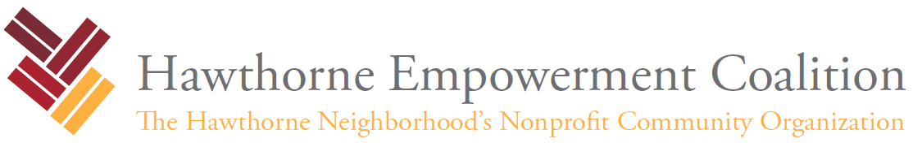

<h3 style="text-align: center;">Please attend our April community meeting!</h3>

<h4 style="text-align: center;">When: Thursday, April 24th, 2025</h4>
<h4 style="text-align: center;">Time: 7:00 pm - 8:00 pm</h4>
<h4 style="text-align: center;">Where: Hawthorne Cultural Center at 1200 Carpenter St.</h4>

The Hawthorne Empowerment Coalition is your local RCO (Registered Community Organization).

Join your neighbors and meet the new interim HEC Board! The new board is eager to share how they plan to work together in a new format on behalf of the community. We will discuss the transition plan, key goals, and opportunities for neighbors to get involved.

The agenda for this meeting includes:

- Meet HEC’s new interim board
- Learn the actionable goals of this board
- Treasurer’s report
- Updates on Post Brothers’ commitments
- Gun Violence Program
- Update from the Zoning committee
- Update on the Education Committee
- Neighborhood arts initiatives
- Your questions and concerns

Getting involved in the HEC is a great way to meet your neighbors and support our community. Please send an email to info@hecphila.org if you would like to get involved in the HEC in any capacity or if you have any ideas for grant-funded initiatives in our neighborhood. Our Community Organizer, Stan Horwitz will reach out to you. We hope you get involved!

If you have any questions about Hawthorne or would like to volunteer with the Hawthorne Empowerment Coalition, please email info@hecphila.org or call us at (267) 209-3423.
