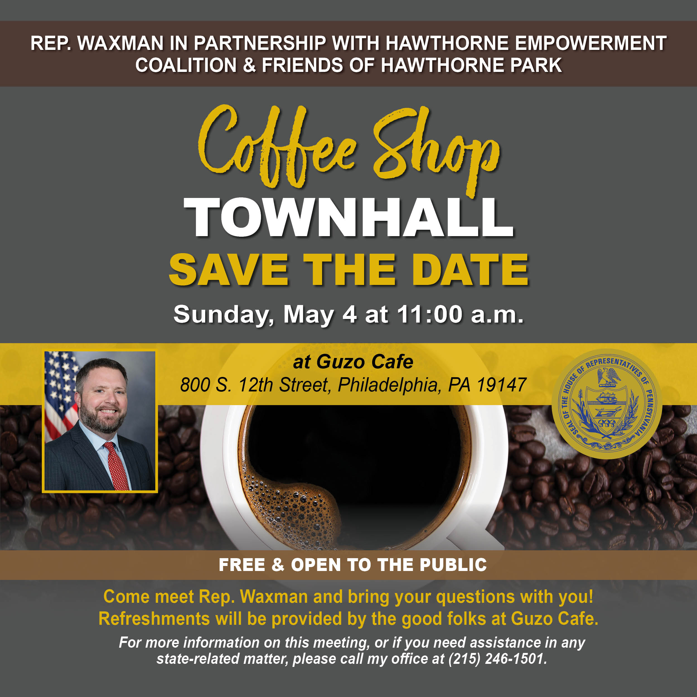

<h4 style="text-align: center;">When: Sunday, May 4th, 2025</h4>
<h4 style="text-align: center;">Time: 11am</h4>
<h4 style="text-align: center;">Where: Guzo Cafe at 800 S. 12th Street</h4>

Greetings from Stan Horwitz, The Hawthorne Empowerment Coalition’s Community Organizer.

You’re welcome to join your neighbors and me to attend a free coffee shop townhall hosted by Representative Ben Waxman. This town hall is being hosted in partnership with the Hawthorne Empowerment Coalition and the Friends of Hawthorne Park on May 4th at the Guzo Cafe at 11:00 a.m. The Guzo cafe is located at 12th and Catherine Streets across the street from Hawthorne Park.

If you have any questions about Hawthorne or would like to volunteer with the Hawthorne Empowerment Coalition, please email info@hecphila.org or call us at (267) 209-3423.
