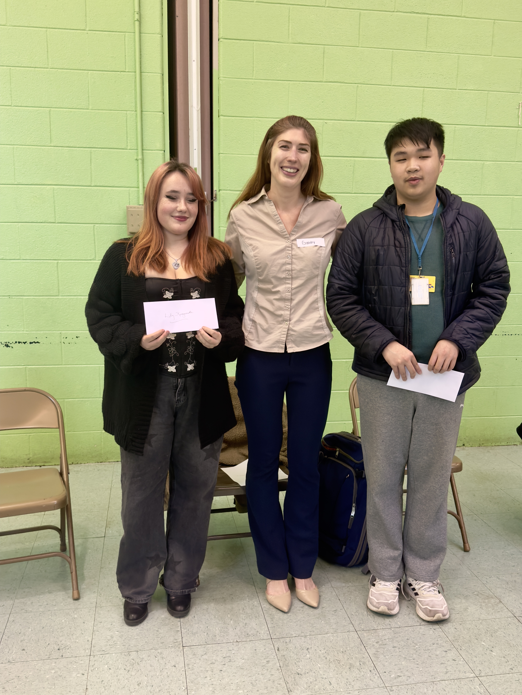

The Hawthorne Empowerment Coalition’s March community meeting on March 27 was a major success! Several residents offered to get involved by serving as officers on the board. We are grateful to all of you who attended this meeting, especially those of you who volunteered to get involved in the HEC.

The highlight of our meeting was the presentation of a scholarship to each of two neighborhood children. Thanks to the Post Brothers’ commitment to our neighborhood through their Community Benefits Agreement, the board members of the HEC are proud to announce this commitment to supporting education in our neighborhood. Gabrielle Thomas, who chairs the HEC’s education committee presented a scholarship to Academy at Palumbo student Eric Zhang and a scholarship to Lily Kempinski, who attends the High School for Creative & Performing Arts. Congrats to Eric and Lily and a big shout out to Gabby for her hard work. Lily, Gabby, and Eric are pictured above. Eric and Lily will both attend Temple University this fall.

Thanks to Ann Lastuvka for taking the reigns as HEC’s new treasurer and doing a fantastic job reporting on the HEC’s finances and for getting involved in the zoning committee.

Thanks also to City Council President Johnson for sending two of his representatives, Sarah and Ahmir to meet with us and hear our concerns.

Stay tuned for an announcement about HEC’s next community meeting, which will be on April 27.

Getting involved in the HEC is a great way to meet your neighbors and support our community. Please send an email to info@hecphila.org if you would like to get involved in the HEC in any capacity or if you have any ideas for grant-funded initiatives in our neighborhood. Our Community Organizer, Stan Horwitz will reach out to you. We hope you get involved!

If you have any questions about Hawthorne or would like to volunteer with the Hawthorne Empowerment Coalition, please email info@hecphila.org or call us at (267) 209-3423.
