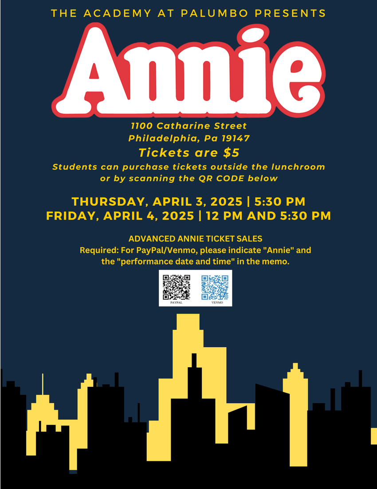

### See and support Annie at Palumbo

#### When: Thursday April 3rd 5:30pm and Friday April 4th 12pm and 5:30pm
#### Where: 1100 Catherine St.
#### Cost: Tickets are $5

Since September 2006, Academy at Palumbo, located at 11th and Catharine Streets has operated as a college preparatory magnet high school within the School District of Philadelphia. It currently has a student body of approximately 1200 students. This year, Palumbo's musical will be Annie and the school would greatly appreciate support from local businesses.

Advertising in the Annie Program Book:
- Purchasing an advertisement in the Annie Program Book goes a long way to show support for the school's drama and music departments, our student performers, and staff. Plus, it is great visibility for businesses.
- Required: Please complete the Advertisement Form (Ad sizes/pricing on form) if you would like to be included in the book.
- Deadline: Ads must be submitted and paid for by March 24.

Questions about advertising in the Program Book should be directed to Palumbo's Home and School Association at palumbogriffinshsa@gmail.com. Thank you for your support!
