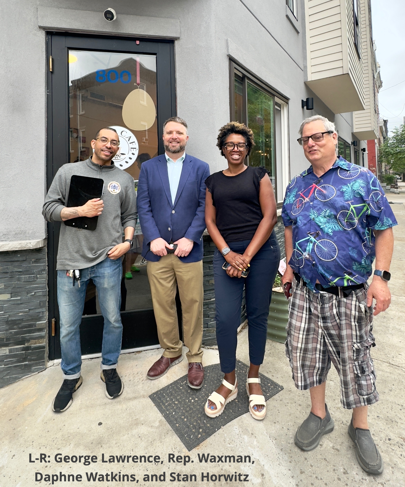
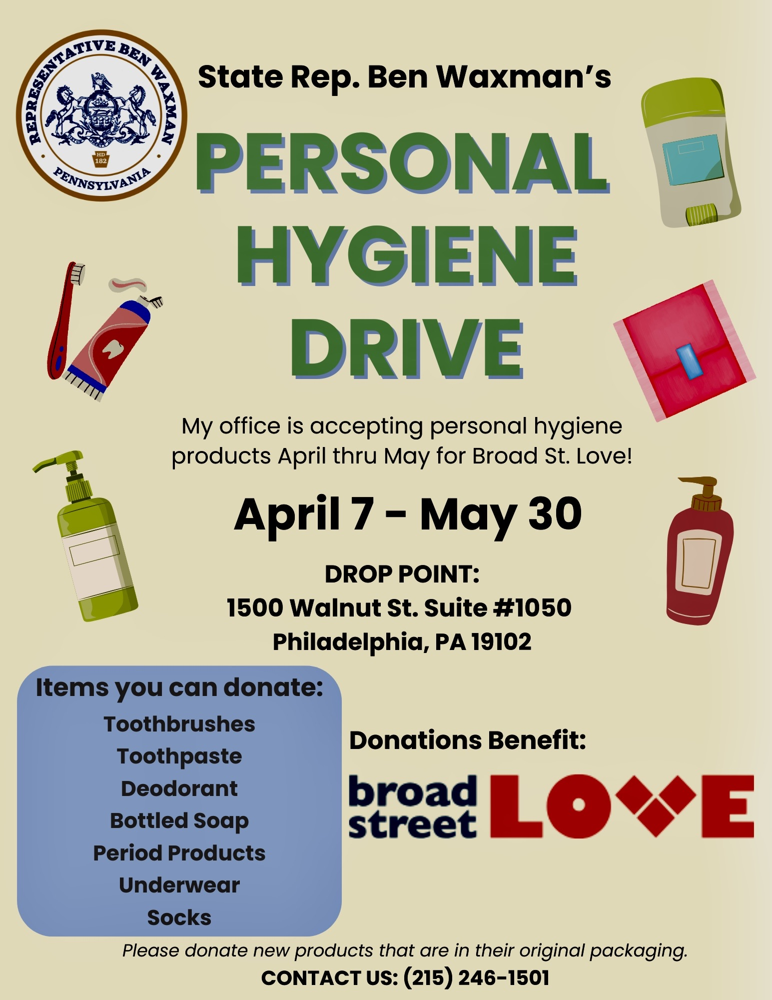
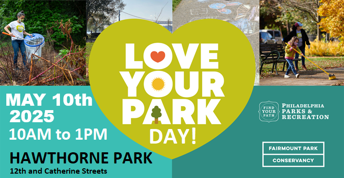
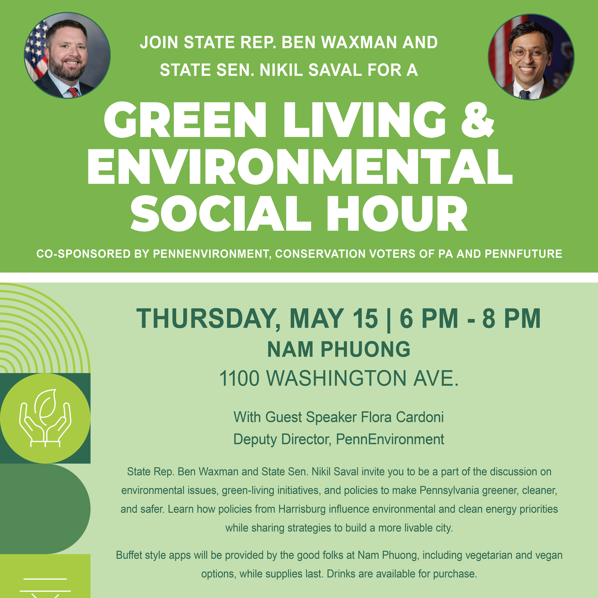
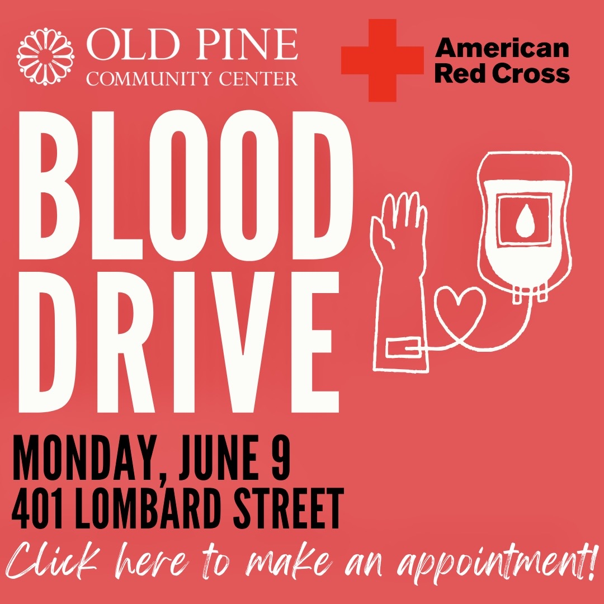

#### Co-Presidents: Daphne Watkins and Greg LaBier
#### Community Organizer: Stan Horwitz

Greetings Neighbors,

Last Sunday, Representative Ben Waxman co-hosted a town hall with the Friends of Hawthorne Park and the Hawthorne Empowerment Coalition at Guzo Cafe. Wubet, the cafe owner, was on hand to welcome the community into the shop. Big thanks to Stan, our community organizer and George Lawrence, from Rep. Waxman’s office for helping to put this event together. HEC’s new co-president, Daphne Watkins, moderated this packed event, allowing our neighbors to ask crucial questions affecting the Hawthorne community.

Rep. Waxman answered questions on affordable housing, gentrification, traffic safety, deteriorating school buildings, and more. The conversation also turned to how national politics affects state and local politics.

Regarding his priorities, Rep. Waxman is heavily focusing on addressing SEPTA’s funding challenges and threats of service cuts. He is keen on connecting with Hawthorne and welcomes the community to send an email with any questions or concerns you may have about our neighborhood. You can call Rep Waxman at 215-246-1501 or email him via his website at https://www.pahouse.com/Waxman/Contact. Please note Rep. Waxman is holding a personal hygiene products drive until May 30th. Bring all products to Broad Street Love (the Broad Street Ministry).

If you have any questions about Hawthorne or would like to volunteer with the Hawthorne Empowerment Coalition, please email info@hecphila.org or call us at (267) 209-3423.

### Upcoming Events/Ways to Get Involved

See below for upcoming events, which you can also see on [our calendar and events page](calendar).

###### Palumbo debate team fundraiser
Three members of the Academy at Palumbo debate team qualify for different national tournaments. Their debate team coach, Kate Sundeen, set up a fundraising page to help send them to their tournaments. These students need your help to meet their $5000 fundraising goal.

If you would like to support them, please use these link: https://app.schoolfundr.org/fund/aap-speechanddebate?utm_source=link&utm_medium=web&utm_campaign=oneclick or https://tinyurl.com/AAPDT

A donation in any amount will be greatly appreciated!

###### Saturday, May 10th is Love Your Park Day at Hawthorne Park 10am-1pm
Let's show some love to Hawthorne Park. Could you help with weeding and cultivating the park planting beds to prepare for the summer season? Click this link to register or just show up, https://www.givepulse.com/event/582856-Hawthorne-Park-Service-Day-Spring-2025

###### Thursday, May 15th Green Living & Environmental Social Hour at Nam Puong 6-8pm
*Nam Phuong at 1100 Washington Ave*

State Rep. Ben Waxman and State Sen. Nikil Saval invite you to be a part of the discussion on environmental issues, green-living initiatives, and policies to make Pennsylvania greener, cleaner, and safer. Learn how policies from Harrisburg influence environmental and clean energy priorities while sharing strategies to build a more livable city.

Buffet style apps will be provided by the good folks at Nam Phuong, including vegetarian and vegan options, while supplies last. Drinks are available for purchase.

###### Thursday, May 15th Jazz at Hawthorne Park 7-8:30 pm
The free concert series starts its 2025 season!

###### Sunday, May 18th, Ridgway Park Cleanup 10am-1pm
Let's show some love to Ridgway Park by coming out and helping with trash pickup, weeding, and mulching.

###### Monday, June 9th Blood Drive
If you are eligible to donate blood, please consider participating in this blood drive at the Old Pine Community Center. You can use the following link to register: https://www.redcrossblood.org/give.html/drive-results?zipSponsor=Old%20Pine%20Community

### Happenings at Hawthorne Cultural Center
###### 1200 Carpenter Street
To register for classes or camp, or for more information on any of these events, please email hawthornecultural@phila.gov or call 215-685-1848.

###### Martial Arts Authentic Kung Fu Class for the Family
*Mondays 5-6 pm*

###### Hawthorne Yarn Club
*Wednesdays and Fridays 6-8 pm*

###### Hawthorne Cultural Center Presents Teen Happy Hour
*Fridays, starting May 23rd from 5:30-7:30 pm*

This exciting event offers a fun and safe environment for teens (12+) to hang out, socialize, and enjoy various activities. To kick things off with a bang, we have a special offer: every teen who shows up on the first Friday will receive a gift card!

###### Hawthorne Cultural Center Presents Passport Philly
6 weeks summer camp starting running July 7th-August 15th for ages 6-12. This camp will include arts and crafts, games, snacks, field trips, sports, performing arts, and more. The fee is $480.
